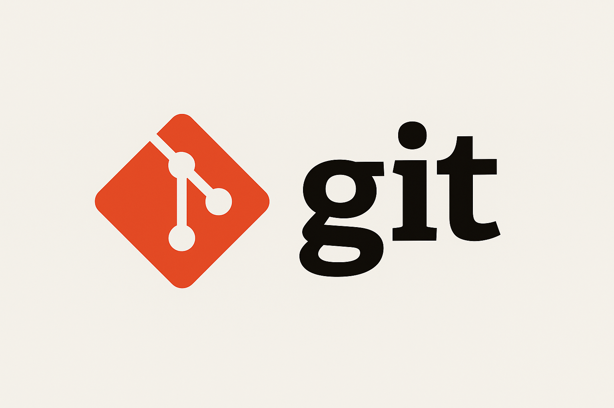

# Markdown and Git Homework

Aquest ser un projecte previ al examen de git,
de la asignatura entorns de desenvolupament, que 
es el equivalent al modul de M05 donat per el 
Alberto.
[Git Documentation](https://git-scm.com/doc)

## TabSle of Contents

- [Introduction](#introduction)
- [Features](#features)
- [Installation](#installation)
- [Usage](#usage)
- [License](#license)

### Introduction

### Features

| Feature   | Description              | Status      |
| --------- | ------------------------ | ----------- |
| Feature 1 | Description of Feature 1 | In Progress |
| Feature 2 | Description of Feature 2 | Completed   |
| Feature 3 | Description of Feature 3 | Not Started |

### Installation

### Usage

### License
